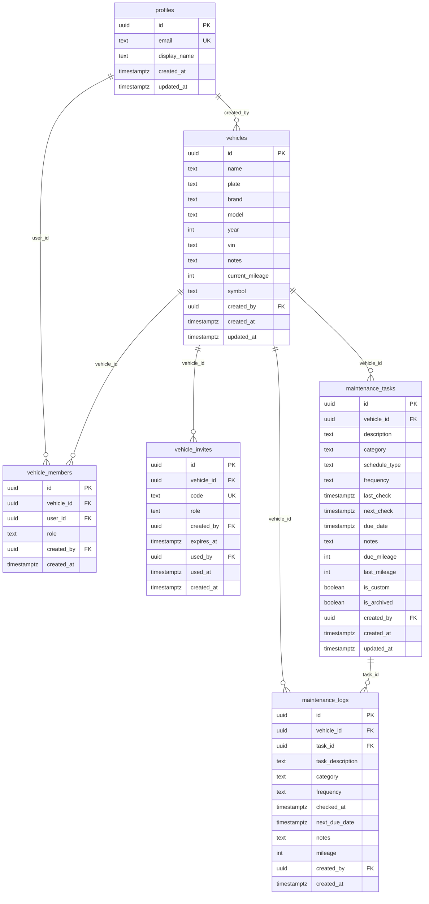

# Architecture

## System Diagram

```
┌─────────────────────────────────────────────────────────────────┐
│                     Vue 3 PWA (Client)                          │
│  Vite + TypeScript + Tailwind CSS                               │
│  Composables → Storage Facade → Local or Supabase repos         │
└──────────────────────────────────┬──────────────────────────────┘
                                   │  localStorage (default)
                                   │  — OR —
                                   │  Supabase JS client (REST + realtime)
                                   ▼
┌─────────────────────────────────────────────────────────────────┐
│                     Supabase (Optional Backend)                 │
│  Auth (magic link OTP) · PostgREST · RLS policies              │
│  Security-definer RPCs for transactional operations             │
└──────────────────────────────────┬──────────────────────────────┘
                                   │  Postgres wire protocol
                                   ▼
┌─────────────────────────────────────────────────────────────────┐
│                     PostgreSQL                                  │
│  Tables: profiles, vehicles, vehicle_members,                   │
│  vehicle_invites, maintenance_tasks, maintenance_logs           │
│  Triggers: updated_at auto-set, handle_new_user                 │
└─────────────────────────────────────────────────────────────────┘
```

## Technology Choices

| Layer | Technologies | Rationale |
|-------|-------------|-----------|
| **Framework** | Vue 3 (Composition API, SFCs) | Lightweight, excellent TypeScript support, reactive composables map naturally to the domain (each module = one composable) |
| **Build** | Vite 6 | Near-instant HMR, native ESM, first-class Vue/TS support |
| **Language** | TypeScript | Catch type mismatches between local and Supabase models at compile time |
| **UI** | Tailwind CSS + Heroicons + Font Awesome | Utility-first for rapid prototyping; Heroicons for nav, Font Awesome for vehicle symbols |
| **Routing** | vue-router (hash mode) | Hash mode avoids server-side redirect config for static hosts (Netlify, GH Pages) |
| **PWA** | vite-plugin-pwa (injectManifest mode) | Custom service worker with periodic background sync for overdue task notifications; install banner; offline caching |
| **Backend** | Supabase (@supabase/supabase-js) | Auth + Postgres + RLS in one service; generous free tier; no custom server to maintain |
| **Auth** | Magic link OTP (Supabase Auth) | No passwords to manage or leak; email-only flow is the lowest-friction auth for casual users |
| **Local storage** | localStorage with versioned JSON envelopes | Dead simple, works offline, migrateable via version field |
| **Deployment** | Netlify + GitHub Pages | Free static hosting with CI; Netlify for preview deploys, GH Pages for production |

## Project Structure

```
omiigo-car/
├── index.html                          # SPA entry point
├── src/
│   ├── main.ts                         # App bootstrap, router, PWA registration
│   ├── App.vue                         # Root: AppShell with router-view
│   ├── router.ts                       # 5 routes: /, /map, /maintenance, /music, /settings
│   ├── sw.ts                           # Custom service worker (periodic sync, overdue check)
│   ├── style.css                       # Tailwind base imports
│   ├── pages/                          # One page per route
│   │   ├── HomePage.vue
│   │   ├── MapPage.vue
│   │   ├── MaintenancePage.vue
│   │   ├── MusicPage.vue
│   │   └── SettingsPage.vue
│   ├── components/                     # Reusable UI components
│   │   ├── AppShell.vue                # Bottom nav + layout
│   │   ├── TaskCard.vue                # Single maintenance task
│   │   ├── TaskFormModal.vue           # Create/edit task form
│   │   ├── LogModal.vue                # Maintenance log history
│   │   ├── VehicleProfileCard.vue      # Vehicle edit form
│   │   ├── VehicleSwitcherCard.vue     # Multi-vehicle dropdown
│   │   ├── VehicleSharingCard.vue      # Invite/member management
│   │   ├── MigrationWizard.vue         # Local-to-cloud data migration (4-step dialog)
│   │   ├── AuthCard.vue                # Magic link login
│   │   ├── BackupPanel.vue             # JSON export/import
│   │   ├── DebugPanel.vue              # Simulated date, dev tools
│   │   ├── StatusToast.vue             # Success/error feedback
│   │   └── PwaInstallBanner.vue        # "Add to home screen" prompt
│   ├── composables/                    # Reactive state + business logic
│   │   ├── useVehicleProfile.ts        # Active vehicle, CRUD
│   │   ├── useMaintenanceData.ts       # Task list, save/archive/restore + cache for SW
│   │   ├── useMaintenanceLogs.ts       # Log history, add log
│   │   ├── useSavedPlaces.ts           # Map module state
│   │   ├── usePlaylistShortcuts.ts     # Music module state
│   │   ├── useAppPreferences.ts        # Settings, favorites, car mode
│   │   ├── useAuth.ts                  # Supabase session management
│   │   ├── useNotifications.ts         # Push notification permission + periodic sync
│   │   └── usePwaInstall.ts            # beforeinstallprompt handler
│   ├── services/storage/               # Data access layer
│   │   ├── types.ts                    # Repository interfaces
│   │   ├── provider.ts                 # VITE_STORAGE_PROVIDER → 'local' | 'supabase'
│   │   ├── index.ts                    # Facade: routes to local or supabase repos
│   │   ├── localVehiclesRepository.ts
│   │   ├── localMaintenanceTasksRepository.ts
│   │   ├── localMaintenanceLogsRepository.ts
│   │   ├── supabaseVehiclesRepository.ts
│   │   ├── supabaseMaintenanceTasksRepository.ts
│   │   ├── supabaseMaintenanceLogsRepository.ts
│   │   ├── supabaseUserDataRepository.ts # User-level key-value CRUD (places, playlists)
│   │   ├── migrationService.ts         # Local → cloud migration engine
│   │   └── inviteService.ts            # Invite/member RPCs
│   ├── types/                          # TypeScript interfaces
│   │   ├── maintenance.ts              # VehicleProfile, MaintenanceTask, MaintenanceLog
│   │   ├── supabase.ts                 # Row types mirroring Postgres schema
│   │   ├── map.ts                      # SavedPlace, NavigationProvider
│   │   ├── music.ts                    # PlaylistShortcut, MusicProvider
│   │   └── preferences.ts             # AppPreferences, CarMode, HomeWidgets
│   ├── constants/                      # Static data
│   │   ├── builtInMaintenanceTasks.ts  # 7 core German maintenance task definitions
│   │   ├── maintenance.ts              # Frequency labels, category colors
│   │   └── storage.ts                  # localStorage keys, schema versions
│   ├── utils/                          # Pure functions
│   │   ├── maintenanceDates.ts         # getNextCheckDate, getCurrentDate, toDateInputValue
│   │   ├── maintenanceTasks.ts         # enrichTasks (status computation)
│   │   ├── storage.ts                  # readRawStorage, writeStorageEnvelope
│   │   ├── storageMigrations.ts        # Version-aware localStorage migration
│   │   ├── storageValidators.ts        # Type guards for persisted data
│   │   ├── deepLinks.ts               # Google Maps / Apple Maps / Waze URL builders
│   │   ├── musicIcons.ts              # Provider → icon mapping
│   │   └── backup.ts                  # Export/import JSON blob
│   └── lib/
│       └── supabase.ts                 # Supabase client singleton
├── supabase/
│   ├── schema.sql                      # Full schema: tables, indexes, triggers, RLS, RPCs
│   ├── patch-create-vehicle-rpc.sql    # RPC return shape fix (returns table)
│   ├── patch-create-vehicle-rpc-id.sql # RPC return shape fix (returns uuid)
│   ├── patch-member-management-rpcs.sql # list/update/remove members, revoke invites
│   ├── patch-user-data-table.sql       # user_data table for user-level key-value storage
│   └── patch-biweekly-frequency.sql    # Add 'biweekly' to frequency CHECK constraints
├── public/                             # PWA icons (SVG)
├── vite.config.ts                      # Vue + PWA plugin config
├── tailwind.config.js                  # Content paths
├── postcss.config.js                   # Tailwind + autoprefixer
├── tsconfig.json                       # TypeScript config
├── netlify.toml                        # SPA redirect, publish dist/
├── .github/workflows/deploy.yml        # GH Pages CI (Node 18)
├── .env.example                        # VITE_STORAGE_PROVIDER, VITE_SUPABASE_*
└── package.json                        # Dependencies and scripts
```

## Key Domain Concepts

| Concept | Description |
|---------|-------------|
| **VehicleProfile** | A car with identity fields (name, plate, brand, model, year, VIN, mileage, symbol). In local mode, one is auto-created. In cloud mode, created via `create_vehicle_with_owner` RPC which atomically creates the vehicle + owner membership. |
| **MaintenanceTask** | Something a vehicle needs — either `recurring` (frequency-based: biweekly to annual) or `scheduled` (one-off due date). 7 built-in German core tasks are auto-created per vehicle. Legacy built-in tasks from older versions are automatically archived. Custom tasks are user-created. Tasks can be archived (hidden) but not deleted if built-in. |
| **MaintenanceLog** | A timestamped record that a task was completed. Captures task description, category, frequency, odometer reading, and the computed next due date. Immutable once created. |
| **Task Status** | Computed at render time (not stored) by `enrichTasks()`: compares `lastCheck` + `frequency` against current date to determine `pending`, `dueSoon`, `dueNow`, `overdue`, or `done`. |
| **Storage Facade** | The `services/storage/index.ts` facade checks `VITE_STORAGE_PROVIDER` + Supabase session at every call. If both are available → Supabase repos. Otherwise → local repos. All repos implement the same interfaces. |
| **Vehicle Membership** | Supabase-only. A join table (`vehicle_members`) linking users to vehicles with a role (`owner`, `driver`, `viewer`). All RLS policies gate access through this table. |
| **Invite Code** | An 8-character alphanumeric code (no ambiguous chars) that grants membership to a vehicle. Created by owners, redeemed by any authenticated user via `accept_vehicle_invite` RPC. Single-use. |
| **AppPreferences** | Per-device settings stored in localStorage: favorite places/playlists, startup module, car mode, home widget visibility, per-vehicle task highlights, developer flags. Not synced to cloud. |

## Data Model



### Enums

| Enum | Values |
|------|--------|
| `VehicleMemberRole` | owner, driver, viewer |
| `TaskScheduleType` | recurring, scheduled |
| `Frequency` | daily, weekly, biweekly, monthly, quarterly, biannual, annual |
| `TaskStatus` (computed) | pending, planned, done, dueSoon, dueNow, overdue |
| `NavigationProvider` | google, apple, waze |
| `MusicProvider` | spotify, youtube-music, apple-music, soundcloud, other |
| `VehicleSymbol` | car, car-side, gauge-high, oil-can, gas-pump, truck, van-shuttle, car-rear, car-burst |

## Data Flow: Mark a Task as Done

1. User taps "Erledigt" on a `TaskCard` component
2. `MaintenancePage.vue` calls `markChecked(task)` which:
   - Reads the current date (real or simulated via `getCurrentDate()`)
   - Computes `nextCheck` using `getNextCheckDate(frequency, now)`
   - Builds a `MaintenanceLog` object with task details, date, mileage
3. Calls `addLog(log)` → `maintenanceLogsRepository.add()` → localStorage `.setItem()` or Supabase `.insert()`
4. Calls `updateTask(updatedTask)` → `maintenanceTasksRepository.update()` → writes `lastCheck`, `nextCheck`, `lastMileage`
5. Vue reactivity triggers `enrichTasks()` recomputation → task moves from "Offen" to "Erledigt" section
6. `StatusToast` shows "Aufgabe als erledigt markiert."

## Data Flow: Storage Provider Selection

1. `provider.ts` reads `import.meta.env.VITE_STORAGE_PROVIDER` at build time → `'local'` or `'supabase'`
2. `index.ts` facade exposes repository objects (`vehiclesRepository`, `maintenanceTasksRepository`, `maintenanceLogsRepository`)
3. Each method calls `shouldUseSupabase()`:
   - If provider is not `'supabase'` → **false** → use local repo
   - If Supabase env vars are missing → **false** → use local repo
   - If no authenticated session → **false** → use local repo
   - Otherwise → **true** → use Supabase repo
4. This check runs on every call, so logging out mid-session gracefully falls back to local

## Deployment

- **Development**: `npm run dev` (Vite dev server, port 5173). Copy `.env.example` → `.env`. Set `VITE_STORAGE_PROVIDER=local` for offline dev.
- **Production (Netlify)**: `npm run build` → `dist/`. `netlify.toml` handles SPA redirect. Auto-deploys from `main`.
- **Production (GitHub Pages)**: `.github/workflows/deploy.yml` builds on push to `main`, deploys `dist/` via `peaceiris/actions-gh-pages`.
- **Supabase**: Run `supabase/schema.sql` in SQL Editor to bootstrap. Apply `patch-*.sql` files incrementally for RPC fixes and member management.
